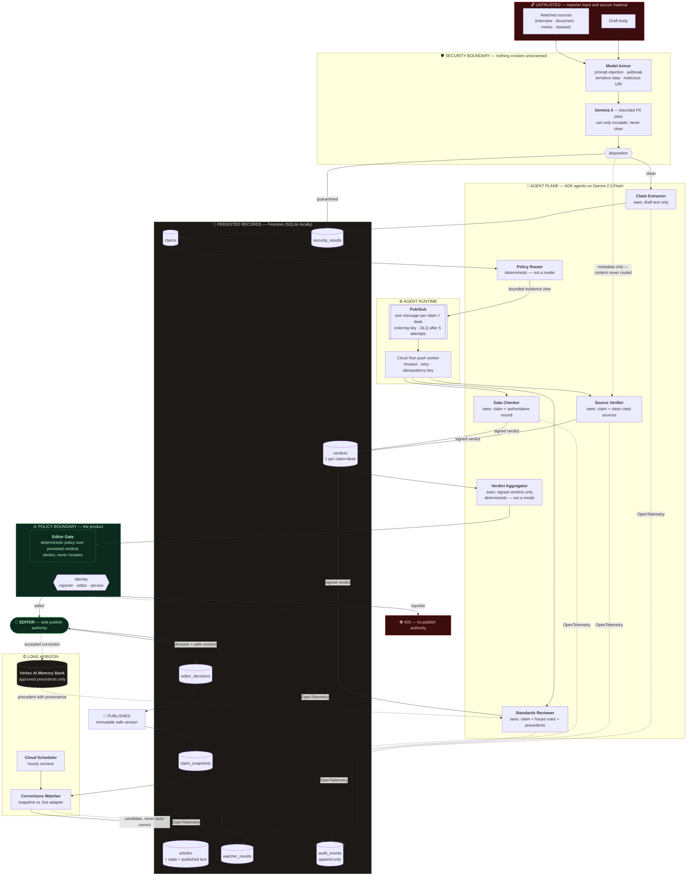

# Architecture

Every model, agent, Google framework, Google Cloud service, trust boundary, and
persisted record in Newsroom Fleet.

> **Architectural invariant.** The publication decision is a deterministic policy
> evaluation over persisted verdict state. It is never a free-form model
> recommendation. Missing evidence, disagreement, quarantine, low confidence, or
> worker failure can never become `VERIFIED`.

---

## The fleet

---

## Models

| Model | Framework | Job | Why it is bounded |
| --- | --- | --- | --- |
| **Gemini 2.5 Flash** | Google ADK (`LlmAgent`) | Claim extraction, source verification, data checking, standards review, correction drafting | One agent per desk, no tools, no sub-agent transfer, schema-constrained output. The evidence in the request is all it can see. |
| **Gemma 3** | Google GenAI SDK | Bounded PII classification at intake (five categories, strict JSON) | Can only *add* a quarantine. It has no path to clear an artifact the primary screener flagged. |

Neither model can route a claim, aggregate verdicts, evaluate the gate, or
publish. Those are deterministic code paths.

---

## Agents and their evidence boundaries

Permissions are data in `domain/masthead.py`. The router builds each desk's view
from that registry, so a desk **cannot** receive evidence its registration does
not permit — the barrier is structural, not prompted.

| Desk | Permitted evidence | May never see |
| --- | --- | --- |
| Claim Extractor | `draft_text` | Sources, adapters, house rules, verdicts |
| Source Verifier | `cited_sources`, `quarantine_metadata` | The Data Checker's answer, quarantined *content* |
| Data Checker | `authoritative_adapter` | Sources, the article's own prose |
| Standards Reviewer | `house_rules`, `precedents` | Sources, adapters, other verdicts |
| Verdict Aggregator | `signed_verdicts` | The article, sources, adapters |
| Corrections Watcher | `published_snapshot`, `live_adapter`, `precedents` | Unpublished claims, sources |

**Independence test:** a reviewer can disagree with the reporter *and* with
another desk, because its evidence boundary and output contract are genuinely
different. The `SourceEvidenceView` dataclass has no field that could carry a
Data Checker verdict.

---

## Google Cloud services

| Service | Role | Interface it sits behind | Local implementation |
| --- | --- | --- | --- |
| **Cloud Run** | Backend API + editor desk | — | uvicorn / vite |
| **Firestore** | All durable state | `Repository` | SQLite |
| **Pub/Sub** | Independent review tasks | `ReviewQueue` | asyncio |
| **Model Armor** | Intake screening | `Screener` | heuristic detector |
| **Vertex AI Memory Bank** | Corrections precedents | `MemoryStore` | JSON file |
| **Vertex AI (Gemini/Gemma)** | Desk reasoning, PII pass | `ReviewDesk`, `Screener` | deterministic desks |
| **Cloud Trace** | Per-claim span waterfall | `observability.tracing` | no-op spans |
| **Cloud Scheduler** | Recurring recheck | HTTP endpoint | UI button |
| **Secret Manager** | Service token | env var | absent (guard inert) |

`GET /api/runtime` reports which implementation is *actually* serving —
a cloud component that fell back to its local one says so.

---

## Trust boundaries

1. **Untrusted → screened.** Every artifact is sanitized before orchestration.
   A quarantined source's content is dropped at the router; the Source Verifier
   receives a `QuarantineNotice` (source id, detector, policy version) and
   returns `UNSUPPORTED`. The injected memo's instruction never exists in any
   reviewer's process memory.

2. **Desk → desk.** Enforced by the evidence view types, not by prompt text.

3. **Model → policy.** A live desk's citation must appear in the
   `allowed_locators` it was handed. A locator outside that list is rejected and
   the verdict downgraded to `UNSUPPORTED` with a `broken_locator` flag — the
   hallucinated-citation defence, applied to every live verdict.

4. **Reporter → editor.** `decide_publish` denies any non-editor role
   server-side, before state changes. The UI's identity toggle only changes what
   the server is told; the refusal is the server's.

5. **Service → editorial.** `/api/internal/*` requires a shared-secret header
   (Cloud Scheduler) or a verified OIDC token from an allowlisted service
   account (Pub/Sub push). Neither endpoint can approve a publication.

---

## Persisted records

| Record | Key | Idempotency / immutability |
| --- | --- | --- |
| `articles` | `article_id` | State moves only through the state machine |
| `claims` | `article_id + claim_id` | Replaced only by re-extraction |
| `verdicts` | `claim_id + desk` | **One per pair.** A healthy verdict is never overwritten; only an `ERROR` may be superseded. Transactional in Firestore, `ON CONFLICT … WHERE result='error'` in SQLite. |
| `security_results` | `security_id` | Written once at intake |
| `editor_decisions` | `decision_id` | Append-only; timestamp and identity system-generated |
| `claim_snapshots` | `article_id + claim_id` | The watcher's baseline |
| `watcher_results` | `watcher_id` | Status moves to `disposed` on editor action |
| `audit_events` | `event_id` | **Append-only.** Carries actor, claim, latency, and `trace_id`. |

The verdict uniqueness rule is what makes Pub/Sub's at-least-once delivery safe:
the guarantee lives in storage, not in the caller.

---

## Failure behaviour

| Failure | Response | Where |
| --- | --- | --- |
| Worker timeout | Retry within budget, then signed `ERROR` verdict with `needs_human` | `orchestration/runner.py` |
| Malformed model JSON | Schema rejection → retry → `ERROR` | `desks/live/_agent.py` |
| Hallucinated citation | Locator validation fails → `UNSUPPORTED` + `broken_locator` | `desks/live/_contracts.py` |
| Prompt injection in source | Quarantined before any desk context | `security/` + `orchestration/router.py` |
| Reviewer disagreement | Both verdicts preserved; gate escalates | `domain/policy.py` |
| Duplicate delivery | One persisted verdict per `claim_id:desk` | `persistence/` |
| Unauthorized approval | Server-side 403 | `domain/policy.py` |
| Data source unavailable | Watcher abstains, retains snapshot | `desks/watcher.py` |
| Broker outage | Audited degradation to in-process execution | `orchestration/router.py` |
| Screening API outage | Heuristic screener runs, result stamped degraded | `security/model_armor.py` |
| Telemetry loss | Spans stop; audit trail and gate unaffected | `observability/tracing.py` |

In every row the failure is **visible** and **blocking**. None of them can
produce a `VERIFIED` verdict or clear the gate.
